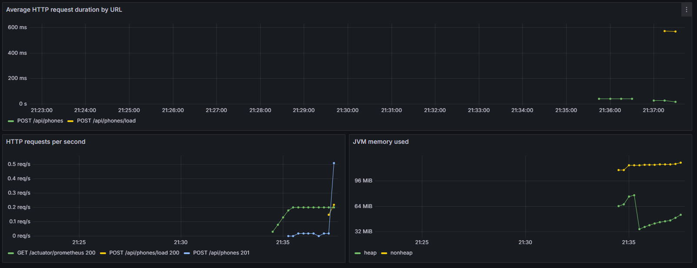
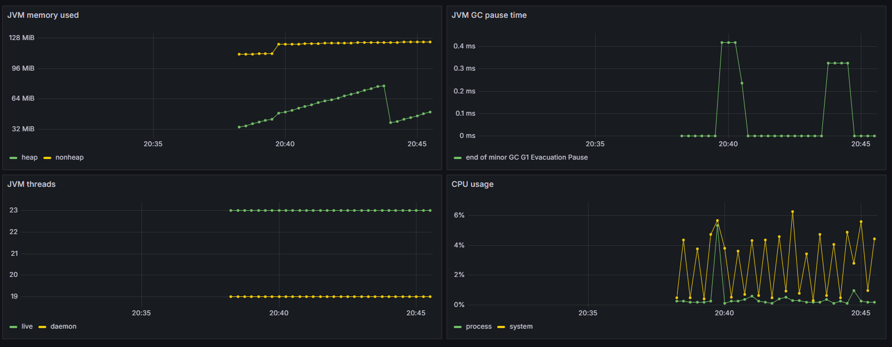

# TipicalProblemsJava

Домашнее задание по troubleshooting.

Ссылка на проект с уроков: https://github.com/RedRad1sh/troubleshooting-lecture

## 1. CRUD-сервис с Runtime БД H2

Создан простой CRUD-сервис на Spring Boot. В качестве хранимой сущности выбран телефон.

Сущность: `Phone`.

| Поле | Описание |
| --- | --- |
| `id` | идентификатор телефона |
| `brand` | бренд телефона |
| `model` | модель телефона |
| `storageGb` | объем памяти в GB |
| `price` | цена телефона |
| `inStock` | наличие телефона на складе |

Код из публичного репозитория не копировался.

Основные endpoints:

| Метод | URL | Описание |
| --- | --- | --- |
| `GET` | `/api/phones` | получить список телефонов |
| `GET` | `/api/phones/{id}` | получить телефон по id |
| `POST` | `/api/phones` | создать телефон |
| `PUT` | `/api/phones/{id}` | обновить телефон |
| `DELETE` | `/api/phones/{id}` | удалить телефон |
| `POST` | `/api/phones/load?iterations=100000000` | создать повышенную нагрузку |

Нагрузочный метод:

```text
POST /api/phones/load?iterations=100000000
```

Метод выполняет долгий CPU-bound цикл и нужен для создания нагрузки на сервис перед снятием дампов потоков.

## 2. Инструкция по запуску в IDEA

1. Открыть проект в IntelliJ IDEA.
2. Выбрать JDK 21.
3. Дождаться Gradle sync.
4. Запустить класс:

```text
com.tipicalproblemsjava.TipicalProblemsJavaApplication
```

5. Проверить health endpoint:

```powershell
Invoke-RestMethod http://localhost:8080/actuator/health
```

Ожидаемый результат:

```json
{
  "status": "UP"
}
```

H2 console:

```text
http://localhost:8080/h2-console
```

Данные для подключения к H2:

| Поле | Значение |
| --- | --- |
| JDBC URL | `jdbc:h2:mem:phones` |
| User | `sa` |
| Password | пусто |

Swagger UI:

```text
http://localhost:8080/swagger-ui.html
```

OpenAPI JSON:

```text
http://localhost:8080/v3/api-docs
```

## 3. Инструкция по запуску в Docker

Собрать jar:

```powershell
.\gradlew.bat clean bootJar
```

Запустить приложение, Prometheus и Grafana:

```powershell
docker compose up --build
```

После запуска доступны:

| Сервис | URL |
| --- | --- |
| Приложение | `http://localhost:8080` |
| Swagger UI | `http://localhost:8080/swagger-ui.html` |
| Prometheus | `http://localhost:9090` |
| Grafana | `http://localhost:3000` |

Логин и пароль Grafana:

```text
admin / admin
```

Если приложение запущено локально из IDEA, а Prometheus и Grafana нужно поднять отдельно:

```powershell
cd metrics
docker compose up
```

## 4. Примеры запросов

Создать телефон:

```powershell
Invoke-RestMethod `
  -Method Post `
  -Uri http://localhost:8080/api/phones `
  -ContentType "application/json" `
  -Body '{"brand":"Apple","model":"iPhone 15","storageGb":128,"price":79900,"inStock":true}'
```

Получить список телефонов:

```powershell
Invoke-RestMethod http://localhost:8080/api/phones
```

Получить телефон по id:

```powershell
Invoke-RestMethod http://localhost:8080/api/phones/1
```

Обновить телефон:

```powershell
Invoke-RestMethod `
  -Method Put `
  -Uri http://localhost:8080/api/phones/1 `
  -ContentType "application/json" `
  -Body '{"brand":"Apple","model":"iPhone 15 Pro","storageGb":256,"price":99900,"inStock":false}'
```

Удалить телефон:

```powershell
Invoke-RestMethod -Method Delete http://localhost:8080/api/phones/1
```

Создать нагрузку:

```powershell
Invoke-RestMethod -Method Post "http://localhost:8080/api/phones/load?iterations=100000000"
```

## 5. Логирование

Добавлено логирование на всех уровнях: `TRACE`, `DEBUG`, `INFO`, `WARN`, `ERROR`.

| Уровень | Где используется | Обоснование |
| --- | --- | --- |
| `TRACE` | чтение телефонов и параметры нагрузочного метода | подробная техническая диагностика |
| `DEBUG` | создание, обновление, удаление, ошибки validation | информация для отладки |
| `INFO` | успешные CRUD-операции и завершение нагрузки | важные события нормальной работы |
| `WARN` | несуществующий телефон или запуск тяжелой нагрузки | подозрительная или потенциально дорогая операция |
| `ERROR` | некорректный параметр нагрузки | запрос невозможно выполнить |

Итерации цикла не логируются в `INFO`, потому что это создало бы слишком много логов и дополнительную нагрузку.

## 6. Тесты и покрытие

Запуск тестов:

```powershell
.\gradlew.bat clean check
```

Покрытие считается через JaCoCo.

| Метрика | Значение |
| --- | --- |
| Количество тестов | 9 |
| Покрытие | 96.58% |
| Требование задания | 50% и выше |

HTML-отчет JaCoCo:

```text
build/reports/jacoco/test/html/index.html
```

## 7. Дампы потоков и памяти

Для снятия дампов использовался `jcmd`.

Скрипт:

```text
scripts/capture-diagnostics.ps1
```

Пример команды:

```powershell
.\scripts\capture-diagnostics.ps1 -ProcessId <PID>
```

Скрипт создает:

| Файл | Описание |
| --- | --- |
| `thread-dump-<timestamp>.txt` | Full thread dump |
| `heap-dump-<timestamp>.hprof` | dump памяти |
| `thread-report-<timestamp>.csv` | расчет нагрузки потоков |

Формула расчета:

```text
Процент нагрузки = (cpu_ms / (elapsed * 1000)) * 100%
```

### Таблица-отчет по thread dump

Файл дампа:

```text
diagnostics/thread-dump-20260501-174108.txt
```

Топ 3 потока:

| Название потока | Время жизни потока elapsed | Время работы потока cpu_ms | Процент нагрузки |
| --- | ---: | ---: | ---: |
| `DestroyJavaVM` | 11.70 sec | 16296.88 ms | 139.290% |
| `http-nio-8080-exec-6` | 12.37 sec | 3875.00 ms | 31.326% |
| `C2 CompilerThread0` | 49.15 sec | 14734.38 ms | 29.978% |

Топ 3 рабочих HTTP-потока:

| Название потока | Время жизни потока elapsed | Время работы потока cpu_ms | Процент нагрузки |
| --- | ---: | ---: | ---: |
| `http-nio-8080-exec-6` | 12.37 sec | 3875.00 ms | 31.326% |
| `http-nio-8080-exec-2` | 12.37 sec | 3703.12 ms | 29.936% |
| `http-nio-8080-exec-9` | 12.37 sec | 3625.00 ms | 29.305% |

Короткий анализ:

- `http-nio-8080-exec-*` попали в топ из-за параллельных запросов на `/api/phones/load`.
- `C2 CompilerThread0` попал в топ из-за JIT-компиляции горячего кода во время нагрузки.
- `DestroyJavaVM` в расчете получился выше 100%, это особенность учета JVM thread в снятом dump.
- Deadlock в дампе не обнаружен.

### Таблица-отчет по dump памяти

Файл dump памяти:

```text
diagnostics/heap-dump-20260501-174108.hprof
```

| Параметр | Значение |
| --- | --- |
| Размер | 58,389,208 bytes |
| Когда снят | во время параллельной нагрузки на `/api/phones/load` |
| Анализ | В heap находятся объекты Spring context, Tomcat, Hibernate, Hikari и H2. Нагрузочный endpoint в основном грузит CPU, поэтому сильного роста heap от него не ожидается. |

## 8. Spring Boot Actuator, Prometheus и Grafana

Подключен Spring Boot Actuator.

Доступные endpoints:

| Endpoint | Описание |
| --- | --- |
| `/actuator/health` | состояние приложения |
| `/actuator/info` | информация о приложении |
| `/actuator/metrics` | список метрик |
| `/actuator/prometheus` | метрики для Prometheus |

Prometheus собирает метрики с:

```text
/actuator/prometheus
```

Добавлены dashboards:

| Dashboard | Файл |
| --- | --- |
| Самостоятельный dashboard для микросервиса | `metrics/grafana/dashboards/phone-service-custom.json` |
| Стандартный dashboard с сайта Grafana | `metrics/grafana/dashboards/jvm-micrometer-standard.json` |

Стандартный dashboard:

```text
JVM (Micrometer), Grafana dashboard ID 4701, revision 10
https://grafana.com/grafana/dashboards/4701-jvm-micrometer/
```

Самостоятельный dashboard содержит 3 панели.

## 9. Скриншоты Grafana

Скриншоты панелей Grafana для микросервиса:





## 10. PromQL-запросы из Grafana

### Самостоятельный dashboard

| Панель | PromQL | Что показывает |
| --- | --- | --- |
| Average HTTP request duration by URL | `sum by (method, uri) (rate(http_server_requests_seconds_sum{application="tipical-problems-java", uri!="/actuator/prometheus"}[1m])) / sum by (method, uri) (rate(http_server_requests_seconds_count{application="tipical-problems-java", uri!="/actuator/prometheus"}[1m]))` | Среднее время запросов по URL. Выполняет требование задания: `sum` делится на `count`, используется `sum by` и `rate`. |
| HTTP requests per second | `sum by (method, uri, status) (rate(http_server_requests_seconds_count{application="tipical-problems-java"}[1m]))` | Количество HTTP-запросов в секунду по method, uri и status. |
| JVM memory used | `sum by (area) (jvm_memory_used_bytes{application="tipical-problems-java"})` | Использование памяти JVM по областям heap и nonheap. |

### Стандартный JVM/Micrometer dashboard

| Панель | PromQL | Что показывает |
| --- | --- | --- |
| JVM memory used | `sum by (area) (jvm_memory_used_bytes{application="tipical-problems-java"})` | Использованная память JVM. |
| JVM GC pause time | `sum by (cause, action) (rate(jvm_gc_pause_seconds_sum{application="tipical-problems-java"}[1m])) * 1000` | Время пауз сборщика мусора. |
| JVM threads | `jvm_threads_live_threads{application="tipical-problems-java"}` и `jvm_threads_daemon_threads{application="tipical-problems-java"}` | Количество live и daemon потоков JVM. |
| CPU usage | `process_cpu_usage{application="tipical-problems-java"}` и `system_cpu_usage{application="tipical-problems-java"}` | Использование CPU процессом и системой. |

## 11. GitHub Actions, Coveralls и release

Pipeline находится в файле:

```text
.github/workflows/ci.yml
```

Pipeline выполняет:

- сборку проекта;
- запуск тестов;
- проверку покрытия;
- сборку jar;
- загрузку jar как artifact;
- отправку coverage в Coveralls;
- создание GitHub Release при push тега `v*`.

Coveralls подключен через:

```text
coverallsapp/github-action@v2
```

Jar собирается командой:

```bash
./gradlew bootJar
```

Release создается через:

```text
softprops/action-gh-release@v2
```

## 12. Выгрузка проекта на GitHub

Создать пустой репозиторий на GitHub без README, `.gitignore` и license.

В папке проекта выполнить:

```powershell
git init
git add .
git status
git commit -m "Implement troubleshooting homework"
git branch -M main
git remote add origin https://github.com/<username>/<repository>.git
git push -u origin main
```

После push нужно открыть вкладку `Actions` и проверить, что pipeline прошел успешно.

## 13. Создание release с jar

После успешной выгрузки на GitHub создать тег:

```powershell
git tag v0.1.0
git push origin v0.1.0
```

После push тега GitHub Actions должен:

- собрать проект;
- прогнать тесты;
- собрать jar;
- создать GitHub Release;
- прикрепить jar к release.

## 14. Что выполнено по пунктам задания

| Пункт задания | Статус |
| --- | --- |
| CRUD сервис с Runtime БД H2 | Выполнено |
| Код не скопирован из публичного репозитория | Выполнено |
| Метод с повышенной нагрузкой | Выполнено |
| Логи | Выполнено |
| Тесты 50%+ | Выполнено |
| Thread dump с elapsed и cpu_ms | Выполнено |
| Dump памяти | Выполнено |
| Таблица по dump потоков | Выполнено |
| Короткий анализ dump | Выполнено |
| TRACE, DEBUG, INFO, WARN, ERROR | Выполнено |
| Spring Boot Actuator | Выполнено |
| Prometheus + Grafana | Выполнено |
| Стандартный dashboard с Grafana.com | Выполнено |
| Самостоятельный dashboard с 3 панелями | Выполнено |
| PromQL-запрос со средним временем по URL | Выполнено |
| PromQL-запросы в таблице | Выполнено |
| GitHub Actions | Выполнено |
| Инструкция запуска в IDEA и Docker | Выполнено |
| Coveralls | Выполнено через GitHub Action |
| Сборка jar | Выполнено |
| Создание release | Настроено через GitHub Actions, выполняется после push тега |

## 15. Что проверить перед сдачей

Перед сдачей нужно убедиться, что:

- проект залит на GitHub;
- GitHub Actions pipeline прошел успешно;
- создан release по тегу `v0.1.0`;
- jar прикреплен к release;
- в `docs/images` лежат оба скриншота Grafana:
  - `grafana-phone-service-custom.png`;
  - `grafana-jvm-standard.png`.
